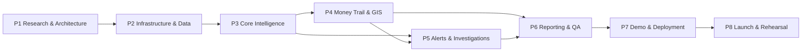

# ROADMAP — CyberPulse AI

| Field | Value |
|---|---|
| Version | 1.0 |
| Horizon | Hackathon delivery (v1.0) → V1 hardening → V2 → Future |
| Related | `implementation/development-strategy.md`, `project-management/milestones.md`, `PRD.md` Part D |

---

## 1. Phase Model

CyberPulse AI is delivered in eight phases. The phase names below are authoritative and are used identically in `REQUIREMENTS.md`, `implementation/phase-*.md` and `implementation/phase-test-matrix.md`.

| Phase | Name | Primary output | Features |
|:--:|---|---|---|
| P1 | Research & Architecture | Complete documentation baseline, contracts, ADRs | — |
| P2 | Infrastructure & Data Foundation | Running skeleton, schema, synthetic corpus, CI, health | FEAT-16, part of FEAT-15 |
| P3 | Core Intelligence & Complaint Workflow | The vertical slice: complaint → prediction → explanation | FEAT-01, FEAT-02, FEAT-05 … FEAT-09, part of FEAT-15 |
| P4 | Money Trail & Geospatial Intelligence | Graph and GIS console | FEAT-03, FEAT-04, FEAT-10 |
| P5 | Actionable Intelligence — Alerts & Investigations | Alert dispatch and case lifecycle | FEAT-11, FEAT-12 |
| P6 | Reporting, QA, Security & Performance | Reports, settings, full quality gates | FEAT-13, rest of FEAT-15 |
| P7 | Demo Mode, Deployment & Production Readiness | `/demo`, containers, deployment, observability | FEAT-14 |
| P8 | Launch, Rehearsal & Post-Launch | Rehearsed demo, smoke suite, retrospective | — |
| P9 | Scam Shield — Citizen Safety (DEC-013) | Public `/safety` section in English and Hindi; citizen reports feed the officer queue | FEAT-17 |
| P10 | Hold Advice, Hold-Rule Replay, Scam Shield additions (DEC-014, planned) | Disputed-amount hold advice on the money trail; RBI proposed-hold replay; QR X-ray and mule-recruitment check | FEAT-18, FEAT-19, FEAT-17 |

### 1.1 Note on phase ordering

The conventional documentation template places the AI layer at Phase 5, after core and advanced features. **CyberPulse AI deliberately inverts this.** The predictive engine is not an enhancement layered onto a working product — it *is* the product, and every screen exists to present or act on its output. Building the UI first would mean building against imagined responses and then discovering, late, that the model cannot produce them.

The AI layer is therefore delivered in **P3**, immediately after the data foundation, and the first complete vertical slice (complaint → features → model → hotspot → window → SHAP → rendered explanation) is the P3 exit gate. This decision is recorded as **ADR-014** in `architecture/architecture-decisions.md`.

---

## 2. Delivery Timeline

Effort is expressed in person-days for a six-person team. Calendar assumes a three-week pre-finals build followed by a 36-hour grand finale window.

| Phase | Effort (person-days) | Calendar | Exit gate |
|:--:|:--:|---|---|
| P1 | 6 | Week 1, days 1–2 | Documentation audit passes with zero orphan requirements |
| P2 | 12 | Week 1, days 3–7 | Seeded database; signal check passes; `/api/health` green |
| P3 | 20 | Week 2, days 1–6 | Live prediction rendered on a complaint page from a real model |
| P4 | 14 | Week 2, day 7 – Week 3, day 3 | Graph and map render real data; hotspot drawer opens |
| P5 | 12 | Week 3, days 4–6 | Alert dispatched, persisted, propagated; investigation lifecycle valid |
| P6 | 12 | Week 3, day 7 – finale prep | All Critical/High test cases pass; metric gates met |
| P7 | 8 | Finale, hours 0–14 | `/demo` runs end-to-end; deployed URLs live |
| P8 | 4 | Finale, hours 14–24 | Two timed rehearsals ≤ 180 s; smoke suite green |
| P9 | 10.5 | Next hackathon, two weeks, one developer | `implementation/phase-9.md` §16 |
| P10 | 10.5 | Planned, two weeks, one developer | `implementation/phase-10.md` §16 |
| **Total** | **109** | | |

Buffer: the remaining finale hours are reserved for defect burn-down and are not allocated to new scope.

---

## 3. Release Plan

### v1.0 — Hackathon Release (this delivery)

The complete vertical slice with all sixteen features, running on synthetic data, deployed to Vercel + Render + Neon, demonstrable in under three minutes.

**Release criteria:** `PRD.md` Part F.

### V1 — Hardening (post-hackathon, 4–6 weeks)

| Item | Rationale |
|---|---|
| Real identity provider and enforced RBAC | Replaces the prototype role switch, which is explicitly not a security control |
| State-level data partitioning | A Maharashtra officer must not read Bihar case data |
| Alert SLA and escalation | An unacknowledged HIGH alert must escalate, not sit |
| Case handover pack export (PDF) | Investigators need a document that leaves the system |
| Model card publication | Formal statement of intended use, limitations and evaluation |
| PostGIS-backed spatial queries | Moves geometry from application code into the database |
| Full audit log UI | Audit events exist in v1.0 but are not browsable |

### V2 — Real-Time (3–6 months)

| Item | Rationale |
|---|---|
| Kafka ingestion for complaints and transactions | Removes the batch assumption; the problem is real-time |
| Online feature store | Feature parity between streaming and batch paths |
| Continuous re-scoring | A prediction should update as the money moves |
| Outcome capture and feedback loop | Record whether a withdrawal actually occurred in the predicted cell and window |
| Supervised retraining on real outcomes | The model becomes better than its synthetic origin |

### V3+ — Future

Cross-case mule-network clustering and syndicate identification; federated learning across state cyber cells; drift monitoring with scheduled revalidation; lawful integration adapters for NCRP, CFCFRMS and bank nodal channels; multilingual complaint parsing for regional-language intake.

---

## 4. Dependency Ordering

Hard sequencing rules:

1. No model training before the signal check passes (P2 → P3).
2. No complaint UI wired to prediction before the prediction API returns a real score (P3 internal ordering).
3. No alert work before a prediction exists to alert on (P3 → P5).
4. No demo-mode polish before P3–P5 exit (protects against RSK-05, scope creep).
5. No deployment sign-off before the P6 security and performance gates pass.

---

## 5. Scope Guardrails

The following are **explicitly out of scope for v1.0** and any request to add them mid-build must be logged in `project-management/decision-log.md` and approved as a scope change:

- Any real data source integration
- Authentication with a real identity provider
- Mobile layouts below 1280 px
- Crypto tracing
- Automated enforcement actions of any kind
- Additional fraud types beyond the specified six
- Additional map layers beyond the specified three
- Any feature that cannot be demonstrated inside the three-minute window

---

## 6. Roadmap Risks

| Risk | Phase at risk | Mitigation |
|---|---|---|
| Model underperforms the metric gates | P3 | Signal check in P2; gate P3 exit on ROC-AUC ≥ 0.85; fall back to LightGBM and re-tune before touching UI |
| Map performance degrades | P4 | Clustering and viewport-scoped ATM queries designed in from the start |
| Alert/investigation state machine churn | P5 | State machine frozen in P1 documentation; changes require a decision-log entry |
| Finale-window deployment failure | P7 | Deploy in P6, not P7; P7 verifies an already-live deployment |
| Rehearsal reveals a narrative gap | P8 | First rehearsal scheduled at the start of P8, not the end |
