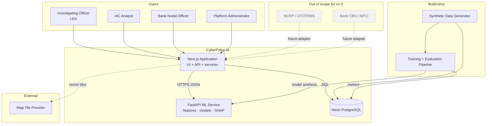
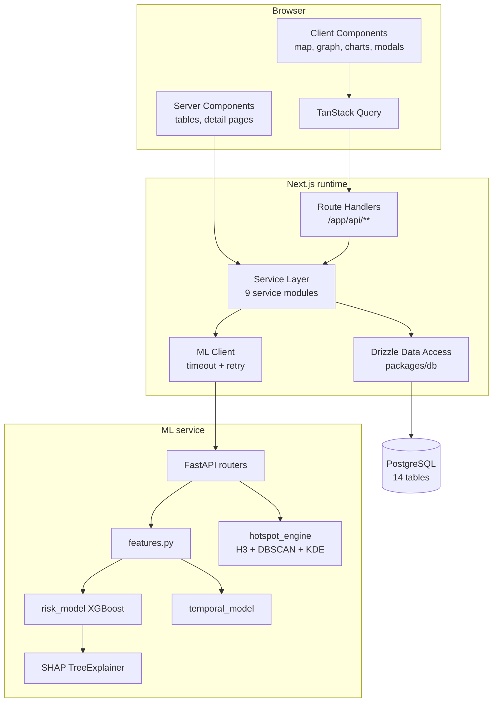
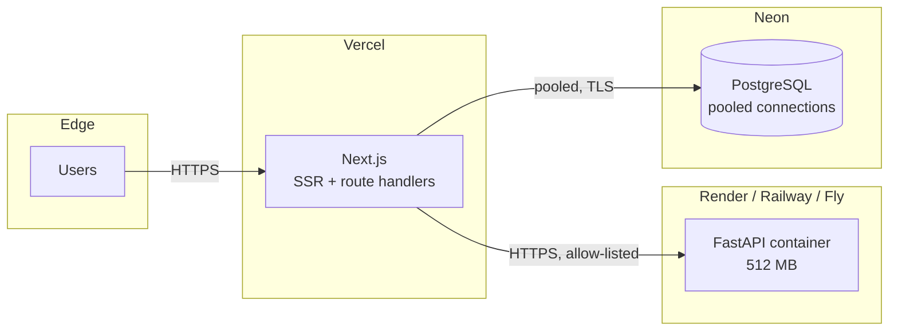

# HIGH-LEVEL ARCHITECTURE — CyberPulse AI

| Field | Value |
|---|---|
| Version | 1.0 |
| Audience | Evaluators, reviewers, and any engineer joining the project |
| Related | `architecture/system-design.md` (detail), `diagrams/system-architecture.md` (diagrams) |

---

## 1. One-Paragraph Summary

CyberPulse AI is a two-service system over a single PostgreSQL database. A Next.js application owns the user experience, the HTTP API, business rules and all persistence; a Python FastAPI service owns feature engineering, model inference, hotspot ranking and explanation, and holds no database credentials. A build-time pipeline generates a deterministic synthetic corpus, validates it, seeds the database, trains the models and writes evaluation metrics back into the database so that the application can publish them. Every number a user sees originates in a model output that was persisted by the web application and returned from the row it wrote.

---

## 2. Context Diagram



The dashed boxes are drawn deliberately. They record that the real data sources are understood, that an adapter boundary exists for them (`architecture/integrations.md`), and that they are **not connected** in this prototype.

---

## 3. Container Diagram



**Note the asymmetry:** Server Components call the service layer directly, without an HTTP hop. Client Components go through route handlers. Both paths converge on the same service modules, so business rules and authorisation cannot diverge between them.

---

## 4. Layering Rules

```
UI ──────────▶ Services ──────────▶ Data Access ──────────▶ Database
 │                 │
 │                 └──────────────▶ ML Client ────────────▶ ML Service
 │
 └─▶ Route Handlers ─▶ Services   (client-component path only)
```

| Rule | Enforcement |
|---|---|
| No SQL in components | ESLint import restriction on `packages/db` from `components/**` |
| No ML calls from components | ESLint import restriction on `services/mlClient` outside `services/**` |
| No business logic in route handlers | Review checklist; each handler is expected to be validate → authorise → delegate → respond |
| No HTTP types in services | `Request`/`Response` types are not importable in `services/**` |
| No cross-service imports | Services compose through the data layer, not through each other, except where documented in `low-level-design.md` |
| Shared types are the contract | `packages/shared` holds the Zod schemas and inferred types used by web, ML client and tests |

The last rule is the mechanism that makes NFR-15 (model/UI consistency) structural rather than aspirational. The prediction response type is defined once; the ML service's Pydantic models are generated from the same JSON Schema; a field rename breaks the build on both sides.

---

## 5. Request Paths

### 5.1 Read path (server-rendered list)

```
Browser ──▶ Next.js RSC ──▶ complaintService ──▶ Drizzle ──▶ Postgres
                                  ▲
                          (no HTTP hop, no serialisation round trip)
```

### 5.2 Read path (client-interactive)

```
Browser ──▶ /api/complaints ──▶ validate ──▶ authorise ──▶ complaintService ──▶ Drizzle ──▶ Postgres
```

### 5.3 Prediction path

```
Browser ──▶ /api/predict ──▶ validate ──▶ authorise ──▶ rate limit
        ──▶ predictionService ──▶ assemble inputs (Drizzle)
        ──▶ mlClient ──▶ FastAPI /predict ──▶ features ──▶ models ──▶ SHAP
        ◀── response
        ──▶ transaction: INSERT predictions + risk_factors
        ◀── persisted representation ──▶ Browser renders
```

### 5.4 Write path with audit

```
Browser ──▶ /api/alerts ──▶ validate ──▶ authorise ──▶ rate limit
        ──▶ alertService ──▶ BEGIN
                              INSERT alerts
                              INSERT audit_events
                              UPSERT investigations
                            COMMIT
        ◀── 201 ──▶ Browser invalidates dashboard/alerts/investigation queries
```

---

## 6. Technology Mapping

| Concern | Technology | ADR |
|---|---|---|
| Web framework and API | Next.js App Router | ADR-001 |
| Language and type safety | TypeScript strict + Zod | ADR-002 |
| Database | Neon PostgreSQL | ADR-003 |
| ORM and migrations | Drizzle + drizzle-kit | ADR-004 |
| Spatial indexing | H3 (no hard PostGIS dependency) | ADR-005 |
| Map rendering | MapLibre GL JS | ADR-006 |
| Graph rendering | React Flow | ADR-007 |
| Charts | Recharts | ADR-008 |
| ML service | FastAPI | ADR-009 |
| Model family | XGBoost (LightGBM alternative) | ADR-010 |
| Explainability | SHAP TreeExplainer | ADR-011 |
| Clustering | DBSCAN + KDE | ADR-012 |
| Problem formulation | Candidate-cell ranking, not coordinate regression | ADR-013 |
| Phase ordering | AI layer at P3 | ADR-014 |
| Component library | shadcn/ui on Radix | ADR-015 |
| Testing stack | Vitest, Playwright, pytest, k6, axe-core | ADR-016 |
| Deployment | Vercel + Render/Railway + Neon | ADR-017 |
| Monetary and temporal storage | Integer paise, UTC | ADR-018 |
| Role model | LEA/BANK/ADMIN, switchable, server-enforced | ADR-019 |
| Error contract | Single typed envelope | ADR-020 |

---

## 7. Deployment Topology



Local development runs the identical topology through Docker Compose, with PostgreSQL as a container instead of Neon. Detail in `architecture/deployment-architecture.md`.

---

## 8. Scaling Envelope

The prototype targets a single-region, single-tenant deployment with tens of concurrent users and a corpus of roughly 500 complaints, 12,000 accounts and 60,000 transactions. Design choices that would become limits at real scale are recorded explicitly in `architecture/scalability.md` — including the synchronous prediction call, the application-side spatial maths, and the absence of a cache tier — each with the specific change that would lift it. Nothing in this document should be read as a claim of national-scale readiness.

---

## 9. What an Evaluator Should Take From This

Three properties distinguish this architecture from a demo-shaped one:

1. **The ML service cannot lie about state.** It has no database access. Every persisted consequence of a prediction is authored by the web application, in a transaction, from the response it received.
2. **The contract is shared, not duplicated.** One schema definition produces the TypeScript types, the runtime validation and the Python models. Divergence between what the model returns and what the UI renders is a build failure, not a runtime surprise.
3. **Every failure has a defined behaviour and a test.** The failure table in `architecture/system-design.md` §5 has no blank cells, and each row names the test that proves it.
