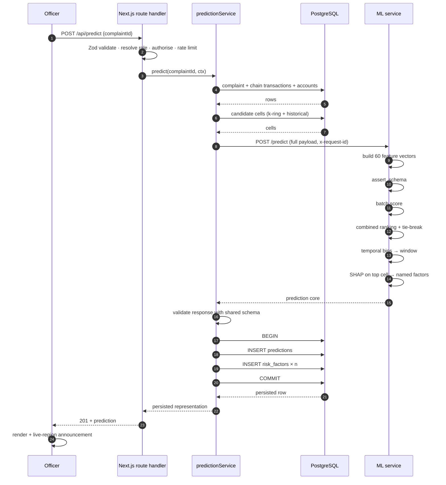
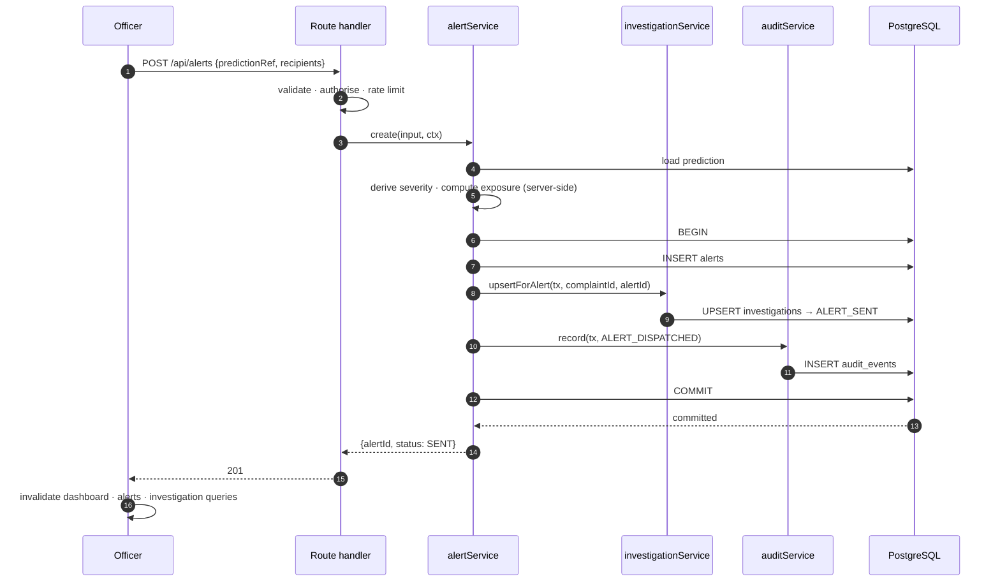
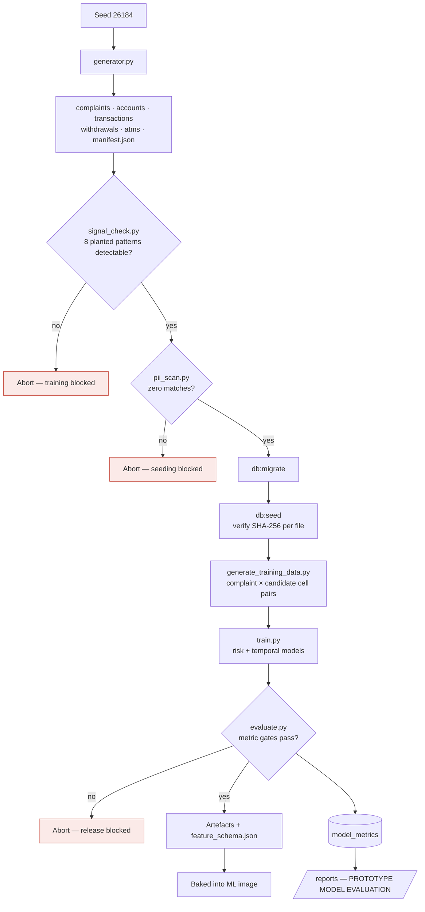
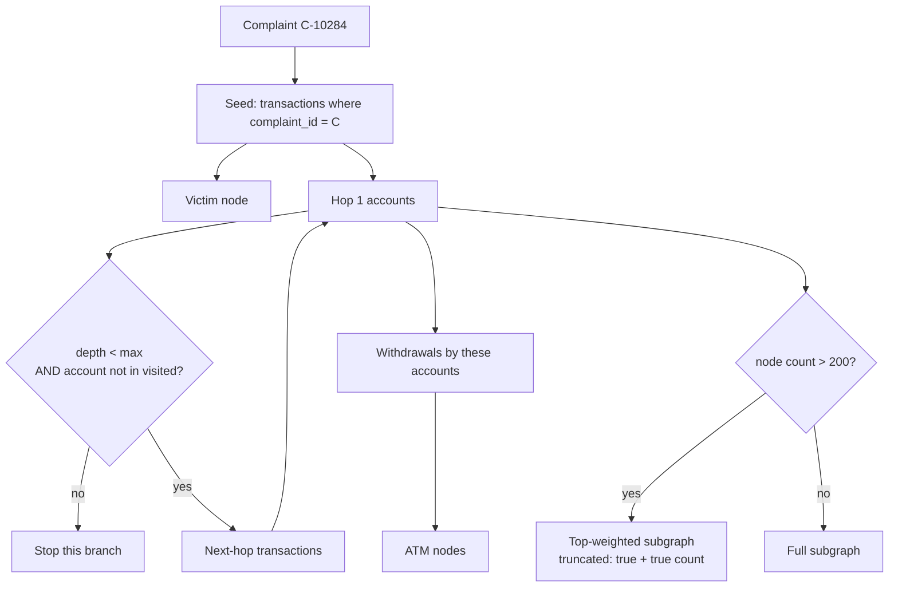
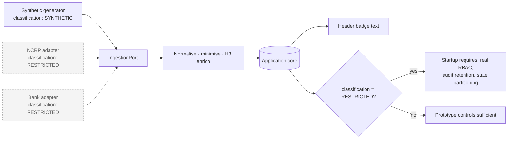
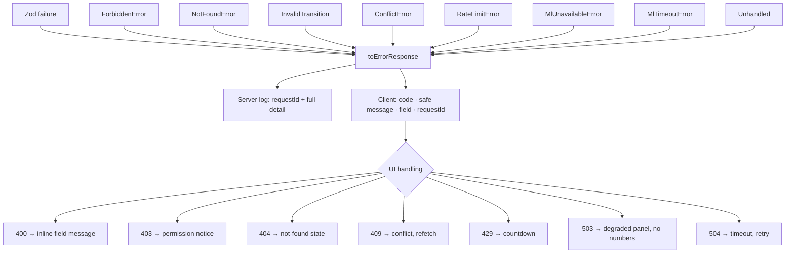

# DIAGRAM — DATA FLOW

---

## D-10 · The value chain, end to end

```mermaid
flowchart LR
  A[Cybercrime<br/>complaint] --> B[Transaction /<br/>account intelligence]
  B --> C[Feature<br/>engineering]
  C --> D[Predictive<br/>ML]
  D --> E[Geospatial<br/>hotspot analysis]
  E --> F[Predicted<br/>withdrawal location]
  F --> G[Predicted<br/>time window]
  G --> H[Explainable<br/>risk score]
  H --> I[Actionable<br/>alert]
  I --> J[Investigator<br/>review]
  J --> K[Proactive<br/>intervention]

  style A fill:#E3EDFB,stroke:#1B5FBF
  style D fill:#DDF2F4,stroke:#0E7C86
  style H fill:#DDF2F4,stroke:#0E7C86
  style I fill:#FBEAE8,stroke:#C0392B
  style K fill:#E6F4EC,stroke:#1F7A47
```

---

## D-11 · Prediction request sequence

Step 24 returns the **persisted** row rather than the ML response, which is what makes NFR-26 testable.

---

## D-12 · Alert dispatch with mandatory audit

If any step between BEGIN and COMMIT fails, none of the three writes occurs. An alert without an audit record cannot exist.

---

## D-13 · Build-time data pipeline

Three non-bypassable gates. In CI none of them accepts a skip flag.

---

## D-14 · Money-trail traversal

Three independent protections — depth bound, visited set, node cap — because any one alone is insufficient.

---

## D-15 · Data classification flow

Classification is data, not configuration. The header badge and the startup gate both derive from it, so a deployment cannot quietly carry real data under prototype controls.

---

## D-16 · Error propagation

One mapping function is the only place an error becomes a response, which is how NFR-13 is guaranteed rather than reviewed.
