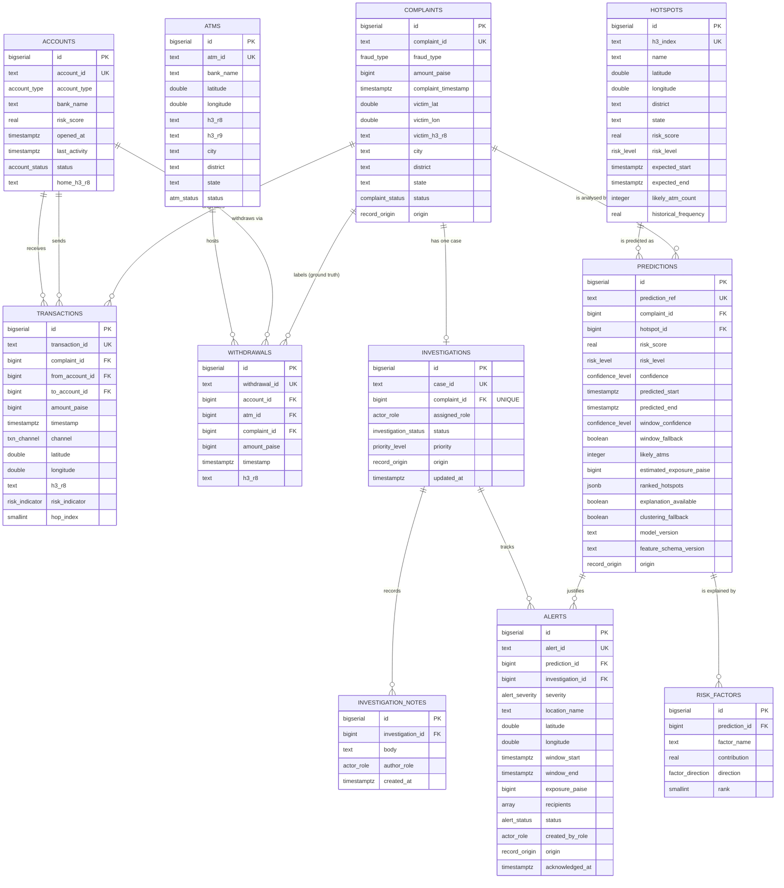
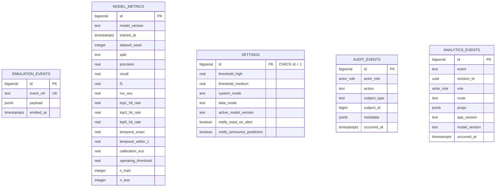
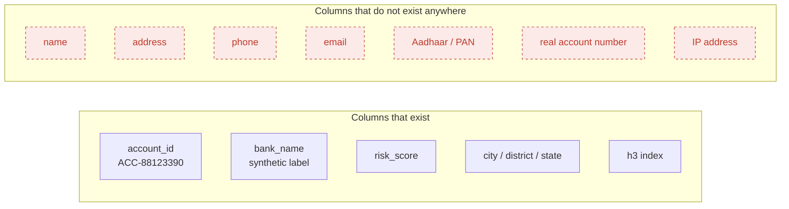
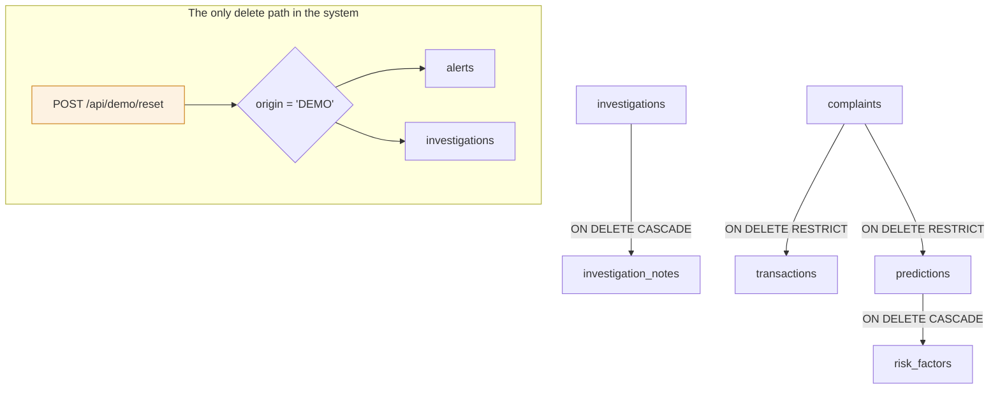
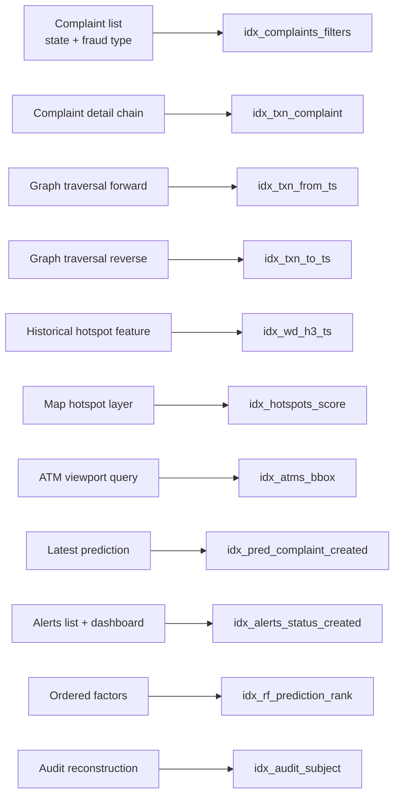

# DIAGRAM — DATABASE ERD

Full column definitions, constraints, indexes and rationale are in `architecture/database-design.md`. This document is the visual index.

---

## D-20 · Core entity relationships

---

## D-21 · Supporting tables

These five tables carry no foreign keys by design. `audit_events` and `analytics_events` reference subjects by type and ID rather than by constraint, so a subject's later removal cannot cascade away its record. `simulation_events` is deliberately isolated from `transactions` so a simulation can never contaminate the analysable corpus.

---

## D-22 · Absence of personal data

This is the structural implementation of CR-01: the schema has nowhere to put personal data, so no adapter, import or feature can introduce it without a visible migration and a review.

---

## D-23 · Cascade and origin behaviour

`CASCADE` appears exactly twice, in both cases where the child has no meaning without its parent. Everything else is `RESTRICT`. The demo reset is the only delete path in application code, and the `origin` filter is what makes it incapable of touching seed data.

---

## D-24 · Index coverage of hot paths

Every index names the query it serves. An index whose query is deleted is deleted with it.
