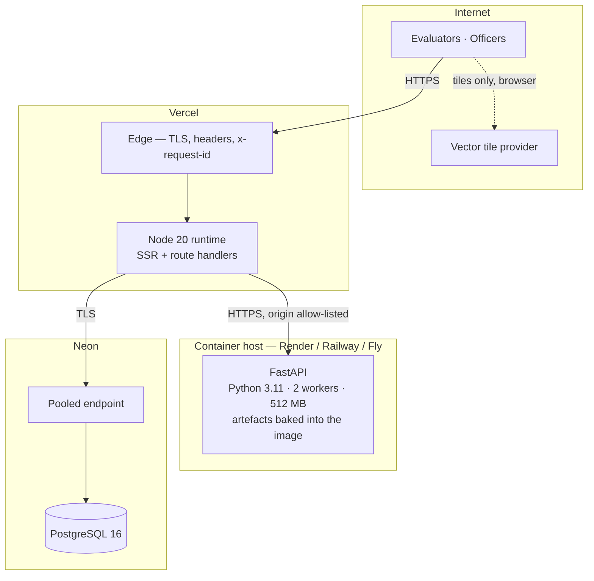
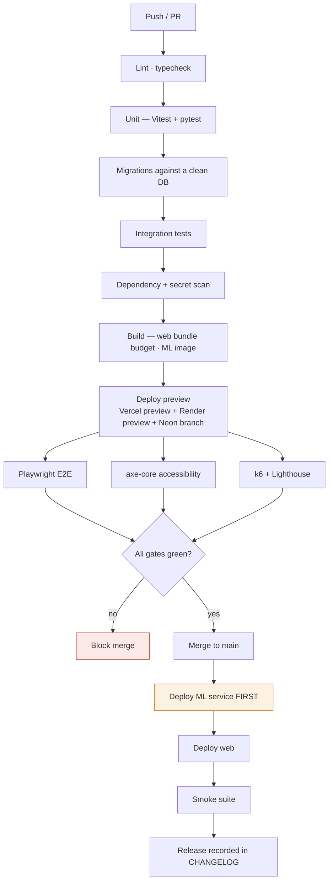
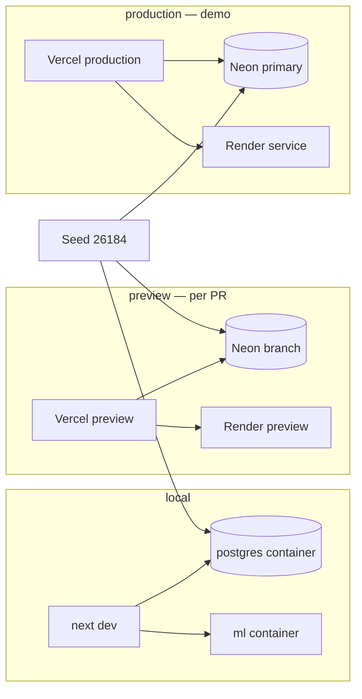
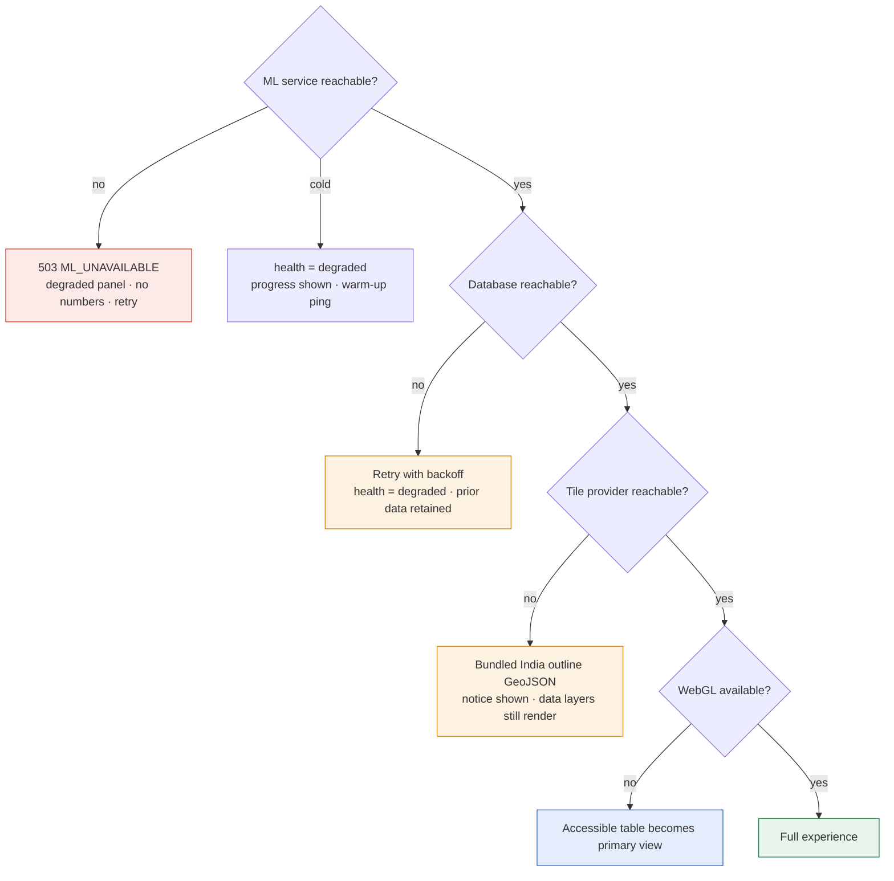
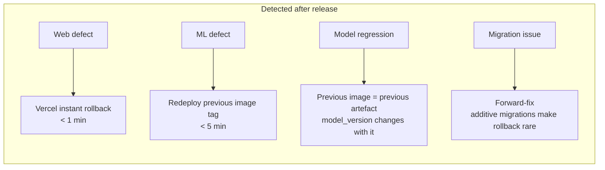

# DIAGRAM — DEPLOYMENT

---

## D-30 · Production (demonstration) topology



The browser never reaches the ML service or the database. Its only direct external dependency is the tile provider, and that has a bundled fallback.

---

## D-31 · Local development

```mermaid
graph TB
  DEV[Developer browser :3000]
  subgraph "Docker Compose"
    WEB[web — next dev :3000]
    ML[ml-service :8000<br/>models mounted read-only]
    PGL[(postgres:16-alpine :5432)]
  end
  DEV --> WEB
  WEB -->|http://ml-service:8000| ML
  WEB -->|postgres://…@postgres:5432| PGL
  ML -.->|reads only| MODELS[/apps/ml-service/models/]
```

Identical topology to production, which is what makes the local stack a viable fallback if venue connectivity fails (`architecture/deployment-architecture.md` §9 step 9).

---

## D-32 · CI/CD pipeline



The ML service deploys first on every release. The web application tolerates an absent ML service by design; the reverse would break the response contract mid-window.

---

## D-33 · Environment isolation



All three environments carry the same seed. A defect reproduced on a preview URL reproduces on a laptop without a data-difference hypothesis.

---

## D-34 · Failure and fallback paths in deployment



No branch ends in a blank screen, a stack trace, or a fabricated value.

---

## D-35 · Rollback paths



Because artefacts are baked into the image, rolling back the ML service rolls back the model, and the `model_version` surfaced in Settings and on every prediction changes with it. There is no state in which the running model and the reported version disagree.

---

## D-36 · Demonstration-day sequence

```mermaid
gantt
  title Demonstration-day runbook
  dateFormat HH:mm
  axisFormat %H:%M
  section Preparation
  Health check all components   :done, h1, 09:00, 5m
  Smoke suite against production:done, h2, 09:15, 10m
  Full /demo warm-up run        :done, h3, 09:30, 5m
  Demo reset                    :done, h4, 09:35, 2m
  Verify C-10284 + model version:done, h5, 09:40, 5m
  section Standby
  Health tab held open          :active, s1, 09:45, 135m
  Local Docker stack on standby :active, s2, 09:45, 135m
  section Evaluation
  Evaluator 1                   :e1, 10:00, 10m
  Reset                         :r1, after e1, 2m
  Evaluator 2                   :e2, after r1, 10m
  Reset                         :r2, after e2, 2m
```


