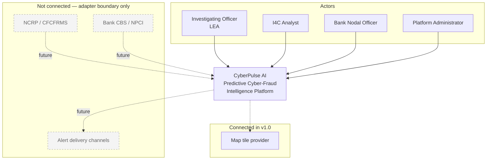
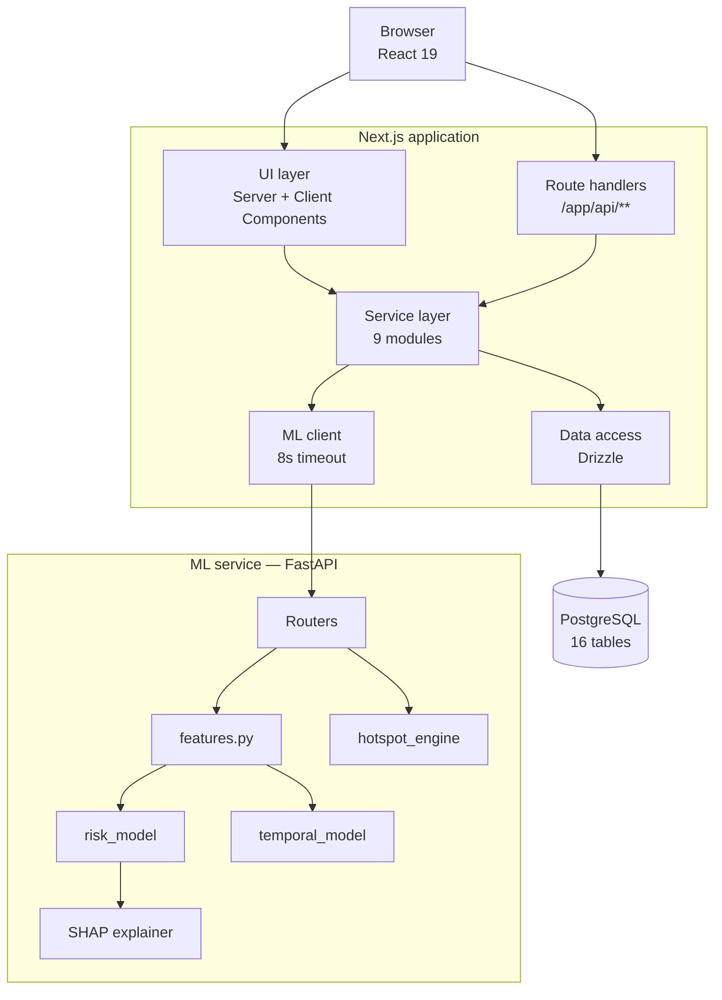
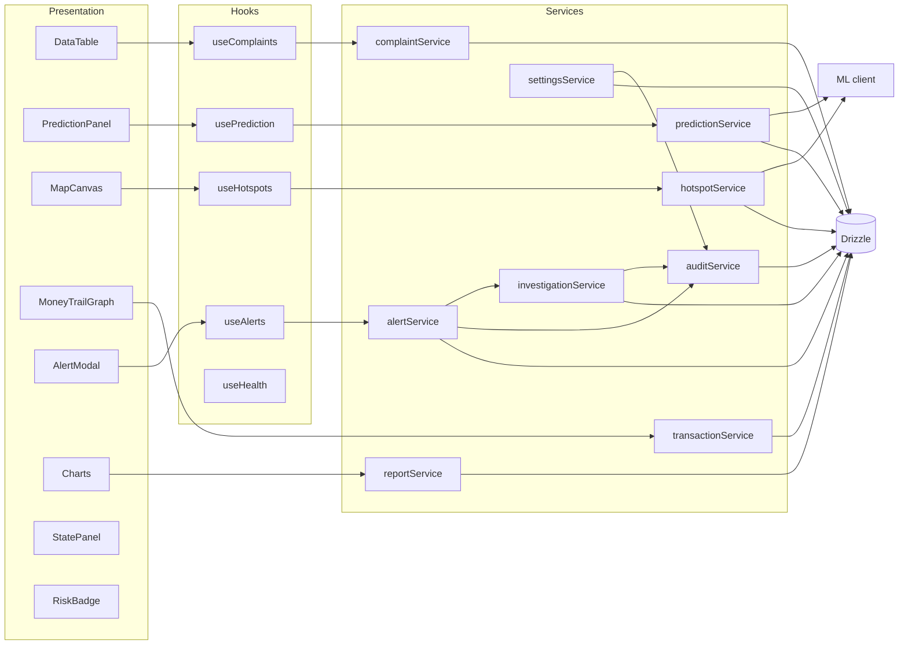
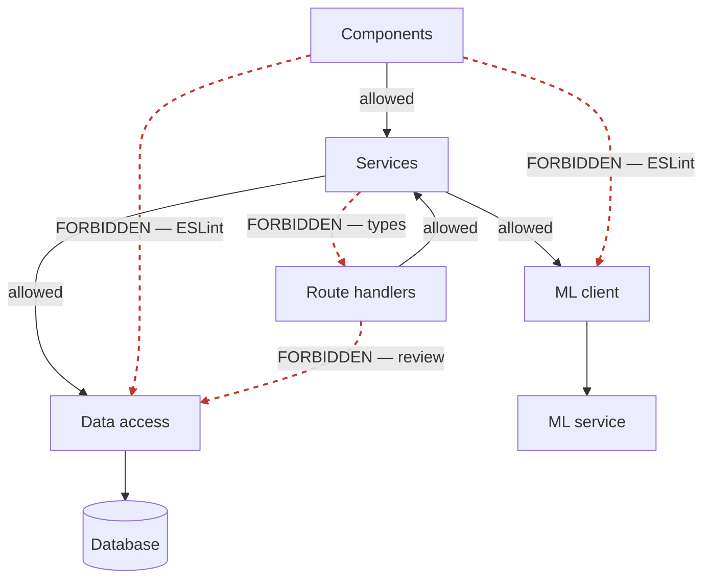

# DIAGRAM — SYSTEM ARCHITECTURE

All diagrams are Mermaid source so they render in GitHub, VS Code and most documentation tooling, and remain diffable in review.

---

## D-01 · Context (C4 Level 1)



---

## D-02 · Containers (C4 Level 2)



The two arrows from the browser are the point: server-rendered surfaces reach the service layer with no HTTP hop, while interactive surfaces go through route handlers. Both converge on one service layer.

---

## D-03 · Components inside the Next.js application



Every arrow into `auditService` originates from a privileged action, and each of those calls passes a transaction handle.

---

## D-04 · ML service internals

```mermaid
graph TB
  IN[POST /predict] --> V[Pydantic validation]
  V --> FB[features.build_vector<br/>one row per candidate cell]
  FB --> AS{assert_schema}
  AS -- mismatch --> ERR[500 FEATURE_SCHEMA_MISMATCH]
  AS -- ok --> SC[risk_model.predict_proba<br/>batch over all candidates]
  SC --> HR[hotspot_engine.combined_score<br/>+ deterministic tie-break]
  HR --> TOP[Top-ranked cell]
  TOP --> TW[temporal_model<br/>12 × 2-hour bins]
  TOP --> SHP[TreeExplainer<br/>top cell only]
  SHP --> AGG[Aggregate 13 features → named factors<br/>normalise to 100%]
  TW --> RESP[Response]
  AGG --> RESP
  HR --> RESP
  SHP -- failure --> NOEXP[factors: [] · explanationAvailable: false]
  NOEXP --> RESP
```

Note the SHAP failure edge: the prediction still returns, but it is never described as explained.

---

## D-05 · Layer boundaries and forbidden edges



The four red edges are the ones that are mechanically prevented rather than merely discouraged (`architecture/low-level-design.md` §7).
