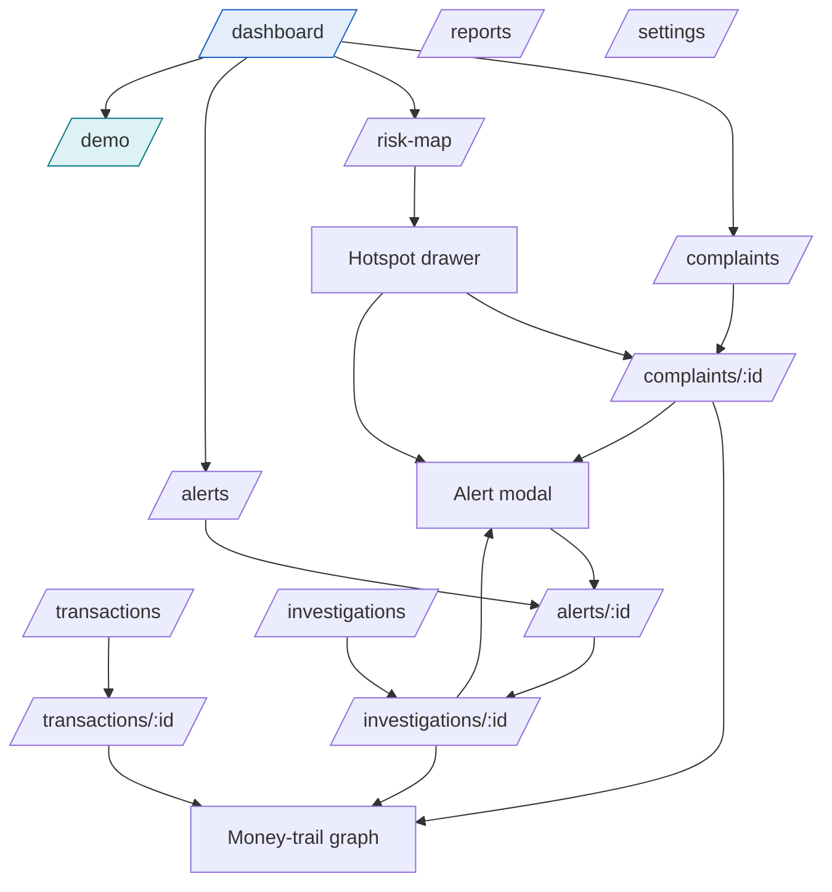
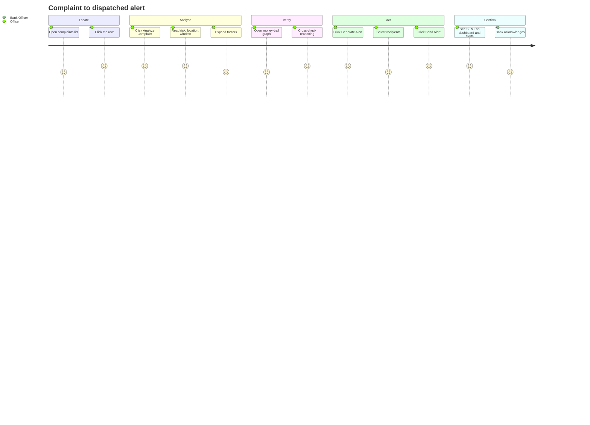
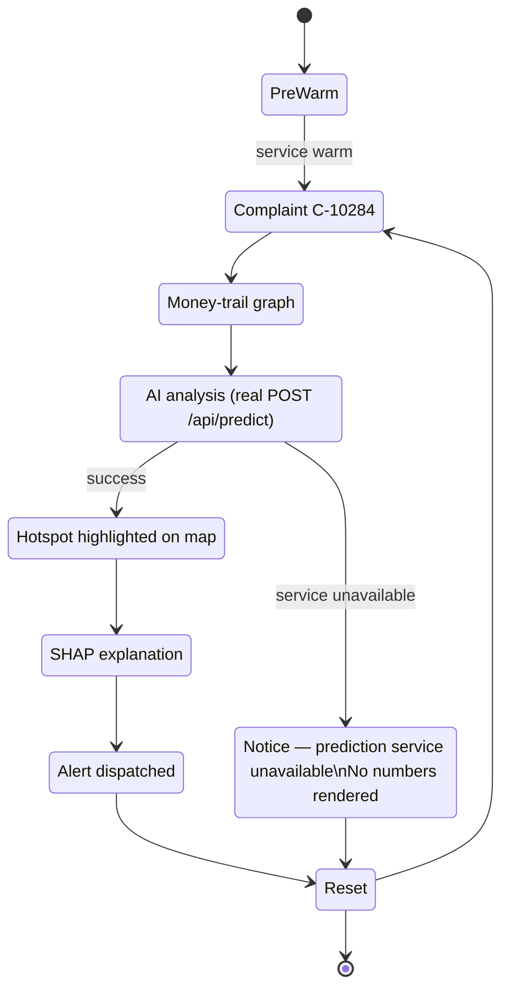
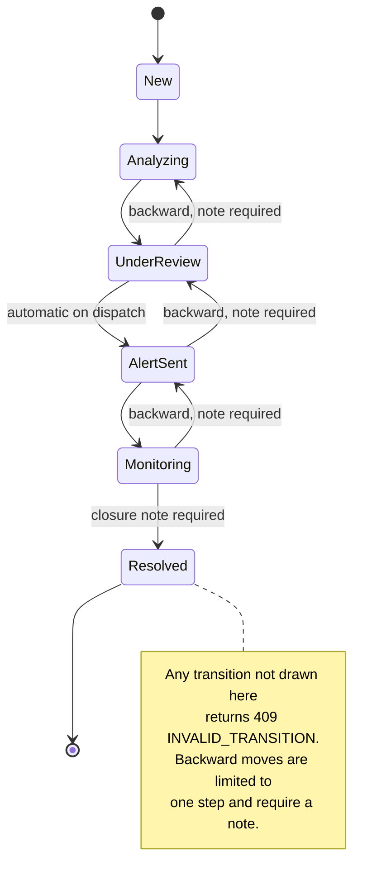
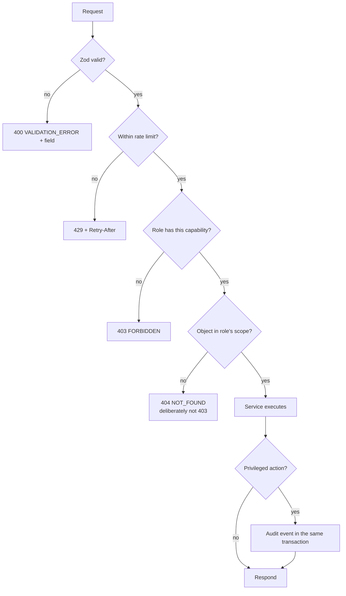
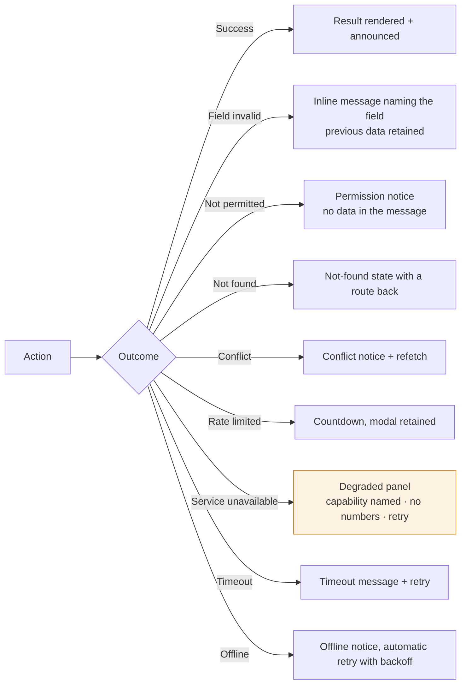
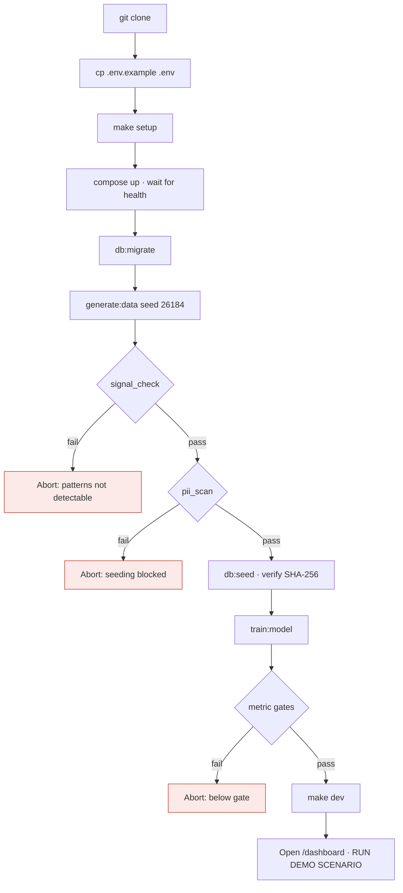

# DIAGRAM — USER FLOW

Narrative versions of these flows are in `product/user-flows.md`; screen-level detail is in `ux/user-flow.md`. This document is the diagram index.

---

## D-40 · Navigation map

No destination is more than two levels deep. The alert modal is reachable from three contexts — complaint detail, hotspot drawer and investigation — because the decision to act arrives from all three.

---

## D-41 · Critical path (five interactions)

Five of these are interactions that advance the task; the rest are reading and verification. The count of five is a design constraint — a sixth requires a decision-log entry.

---

## D-42 · Demonstration flow

The degraded branch is drawn because it is a designed state, not an accident. A demonstration that cannot fail honestly is a demonstration nobody should trust.

---

## D-43 · Investigation state machine

---

## D-44 · Role-scoped request handling

The 404-not-403 branch is deliberate: a 403 would confirm the object exists, which is an information leak in an enforcement context.

---

## D-45 · Error recovery from the user's perspective

Across every branch the user is never shown a blank screen, a raw stack trace, or a number the system did not compute.

---

## D-46 · Developer first-run

Timed against the 30-minute NFR-17 budget by TC-DOC-001.
