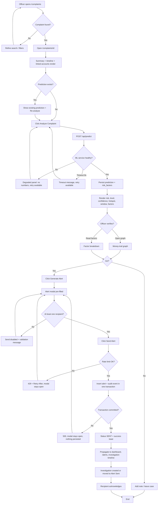
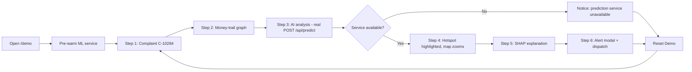
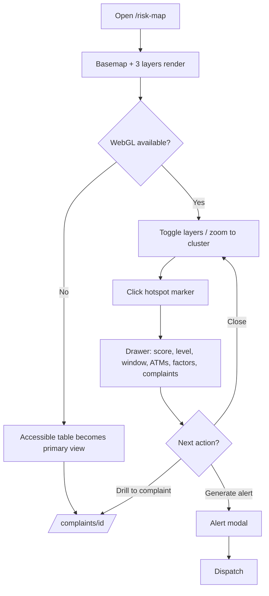
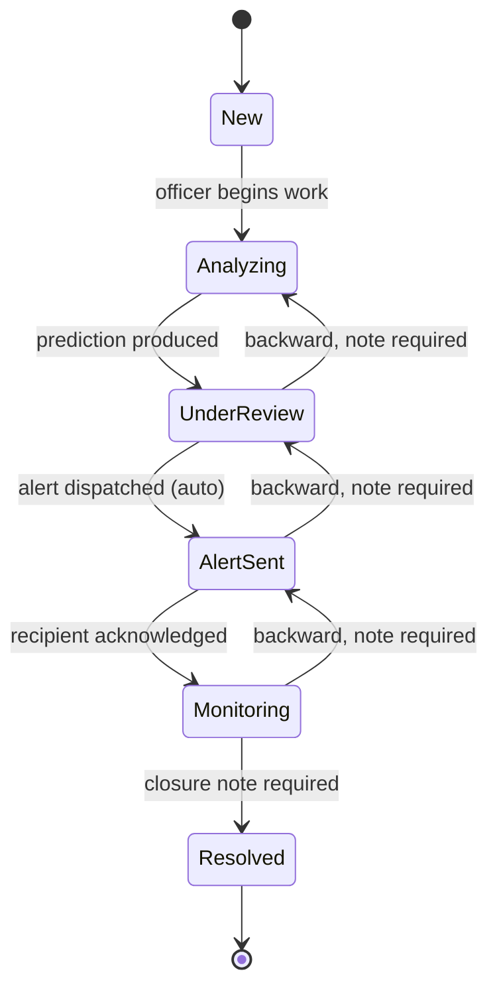
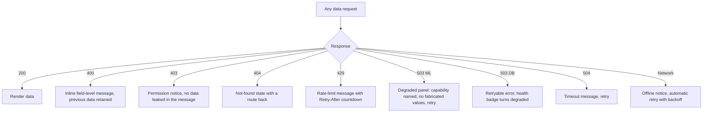
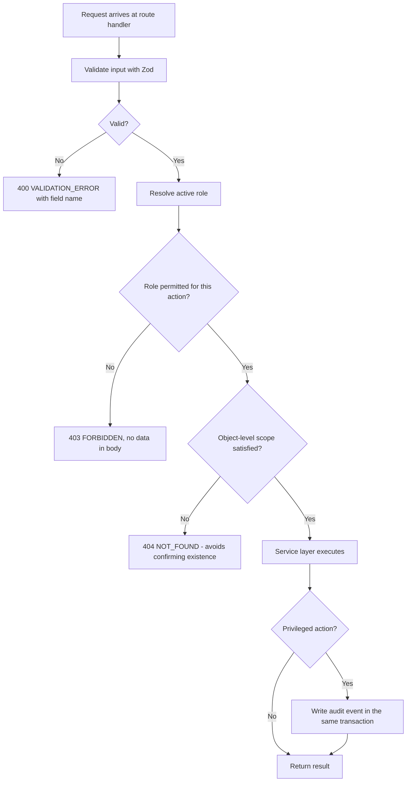
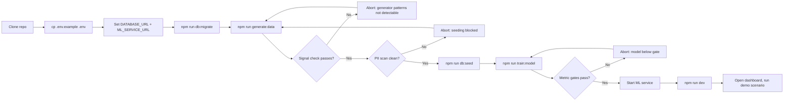

# USER FLOWS — CyberPulse AI

| Field | Value |
|---|---|
| Version | 1.0 |
| Notation | Mermaid flowcharts; decision nodes are diamonds; error paths are annotated |
| Related | `ux/user-flow.md` (screen-level detail), `product/use-cases.md` (narrative form) |

---

## UF-01 — Core value chain: complaint to dispatched alert

**Critical path length:** 5 interactions from complaint list to dispatched alert (open, analyse, generate, select recipient, send). This count is a design constraint — any change that adds a sixth interaction to the happy path requires a decision-log entry.

---

## UF-02 — Judge demonstration flow

Every step is bounded by the actual request duration; no artificial delay is added to make processing "look" like work.

---

## UF-03 — Map-first analyst flow

---

## UF-04 — Investigation lifecycle flow

Any transition not drawn above returns **409 INVALID_TRANSITION**. Backward transitions are limited to one step and require a note (AC-012-02).

---

## UF-05 — Error and degradation flows

**Invariant across every branch:** the user is never shown a blank screen, a raw stack trace, or a number the system did not actually compute.

---

## UF-06 — Role-scoped access flow

Returning **404 rather than 403** for an object the role may not see is deliberate: a 403 confirms that the object exists, which is an information leak in an enforcement context.

---

## UF-07 — First-run / setup flow (developer)

Two gates in this flow are **non-bypassable in CI**: the signal check before training and the PII scan before seeding.

---

## Flow Inventory

| Flow | Personas | Features | Tests |
|---|---|---|---|
| UF-01 | PER-01 | FEAT-01, 02, 04, 05–09, 11, 12 | TC-E2E-001, TC-E2E-010 … TC-E2E-012 |
| UF-02 | All | FEAT-14 | TC-E2E-020 … TC-E2E-023 |
| UF-03 | PER-02 | FEAT-10, 11 | TC-UI-030 … TC-UI-035 |
| UF-04 | PER-01, PER-03 | FEAT-12 | TC-API-040 … TC-API-042 |
| UF-05 | All | Cross-cutting | TC-INT-020 … TC-INT-022, TC-E2E-030 |
| UF-06 | All | FEAT-15 | TC-SEC-010 … TC-SEC-012 |
| UF-07 | Developer | FEAT-16 | TC-DOC-001, TC-DATA-009 |
