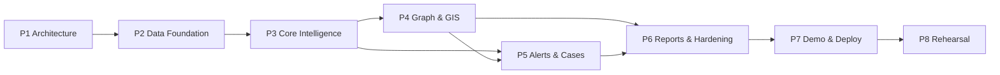

# DEPENDENCY MATRIX — CyberPulse AI

| Field | Value |
|---|---|
| Version | 1.0 |
| Purpose | What blocks what, so a blocked path is visible before someone walks into it |

---

## Phase Dependencies



P5 depends on P4 only for the hotspot drawer's "Generate Alert" entry point. If P4 slipped, P5 could proceed with the prediction-panel entry point alone — the one genuinely optional edge in the graph.

---

## Feature Dependencies

| Feature | Blocked by | Blocks |
|---|---|---|
| FEAT-16 Synthetic data | — | Everything |
| FEAT-05 Feature engineering | FEAT-16 | FEAT-06, 07, 08, 09 |
| FEAT-06 Risk model | FEAT-05 | FEAT-07, 09, 11 |
| FEAT-07 Hotspot engine | FEAT-05, 06 | FEAT-10, 11 |
| FEAT-08 Temporal | FEAT-05 | FEAT-11 |
| FEAT-09 Explainability | FEAT-06 | FEAT-11, 13 |
| FEAT-01 Registry | FEAT-16 | FEAT-02 |
| FEAT-02 Complaint detail | FEAT-01, 06…09 | FEAT-11, 14 |
| FEAT-03 Transactions | FEAT-16 | FEAT-04 |
| FEAT-04 Money trail | FEAT-03 | FEAT-12, 14 |
| FEAT-10 GIS map | FEAT-07 | FEAT-11, 14 |
| FEAT-11 Alerts | FEAT-06…09, 02 or 10 | FEAT-12, 13, 14 |
| FEAT-12 Investigations | FEAT-11 | FEAT-13 |
| FEAT-13 Reports | FEAT-11, 12, and `model_metrics` | — |
| FEAT-14 Demo mode | All | — |
| FEAT-15 Roles and platform | FEAT-16 | Cross-cutting |

**The single longest chain:** FEAT-16 → FEAT-05 → FEAT-06 → FEAT-07 → FEAT-11 → FEAT-12 → FEAT-13. Six links, and every one of them sits on the critical path.

---

## Technical Dependencies

| Component | Requires | Fails how if absent |
|---|---|---|
| `features.py` | Corpus, feature schema | No training, no inference |
| Training | Corpus **passing `signal_check`** | Model learns nothing; discovered days later |
| `evaluate.py` | Trained models, holdout split | No gates, no publishable metrics |
| ML `/predict` | Artefacts loaded at startup | `/health` unhealthy, 503 on predict |
| `predictionService` | ML client, hotspot candidates, database | 503 surfaced as degraded mode |
| Prediction panel | A validated contract in `packages/shared` | UI built against an imagined shape |
| Graph | Traversal CTE, node payload types | Empty or error state |
| Map | Hotspots, ATMs, tile provider | Bundled-outline fallback |
| `alertService` | A prediction, `auditService`, `investigationService` | Cannot dispatch |
| Reports | Alerts, investigations, `model_metrics` | Empty states, "not yet run" |
| `/demo` | Everything | Cannot run |

---

## External Dependencies

| Dependency | Criticality | If unavailable |
|---|---|---|
| Neon PostgreSQL | **Critical** | Local Postgres via Compose |
| ML service host | **Critical** for prediction | Local container |
| Vercel | High | Local `next dev` |
| Map tiles | Low | Bundled India outline, automatic |
| GitHub Actions | Medium | Local `make verify` |
| Container registry | Medium | Local build |

Every critical external dependency has a local fallback, which is the reason Docker Compose parity is a requirement rather than a convenience.

---

## Cross-Team Dependencies

| Who waits on whom | For | Sprint | Unblocked by |
|---|---|:--:|---|
| Frontend B | ML | Prediction contract | S3 | Contract generated in `packages/shared` **before** the model is trained |
| Frontend A | Backend | Network endpoint | S4 | Endpoint stubbed against the shared schema on day 1 |
| Backend | ML | `/predict` shape | S3 | Same shared schema |
| QA | All | Working surfaces | S6 | Tests written against contracts from S3 |
| DevOps | ML | Artefacts for the image | S3 | Placeholder artefact in S2 so the pipeline is exercised early |

The pattern in all five rows: **the contract unblocks before the implementation exists.** That is what `packages/shared` is for, and it is why generating it is a Phase 2 task rather than a Phase 3 one.

---

## Blocking Rules

Four rules that exist because violating them wastes days rather than hours.

1. **No training before `signal_check` passes.** Otherwise a day goes into debugging a model that had nothing to learn.
2. **No seeding before `pii_scan` passes.** A tainted corpus in a database is a governance incident.
3. **No UI wired to prediction before `/predict` returns a real score.** Building against an imagined response defers a contract mismatch to the worst possible moment.
4. **No demo polish before P5 exits.** The RSK-05 guard.

---

## Critical Path

```
Corpus → signal check → features → training → evaluation gates
       → /predict → predictionService → prediction panel
       → alert transaction → investigation lifecycle
       → reports → demo → rehearsal
```

Twelve links. Anything not on this path can slip a day without moving the finish date; anything on it cannot.

The two links with the most uncertainty — the generator and model training — are also the two earliest, which is fortunate: a slip at link 1 or 4 has room to absorb, while a slip at link 10 does not.
