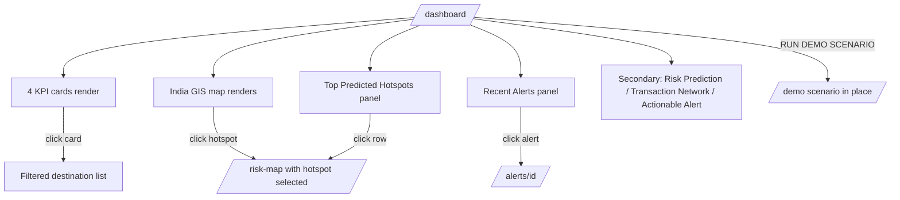
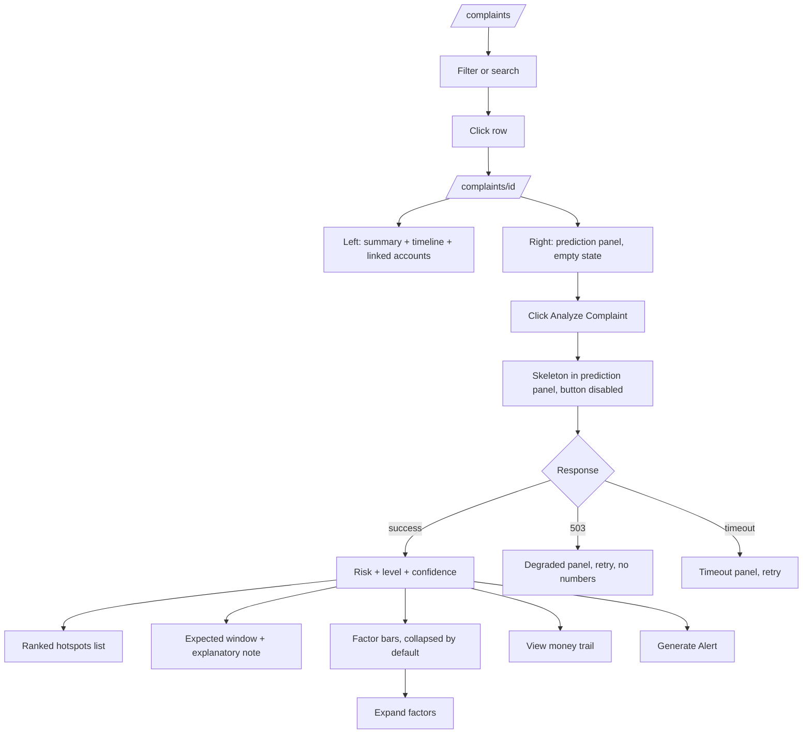
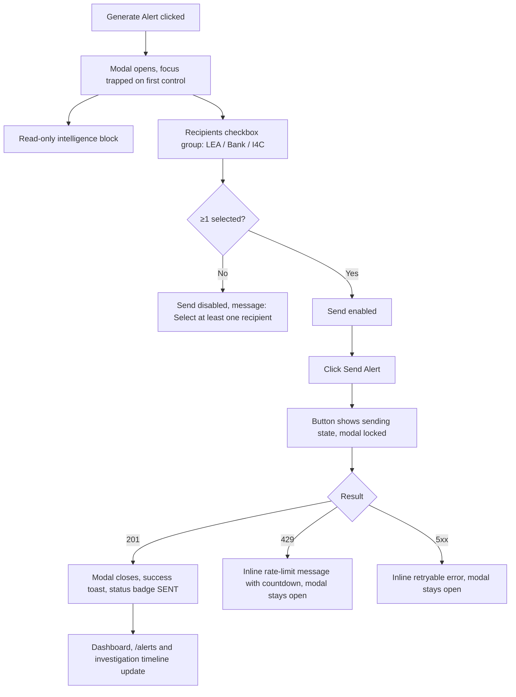
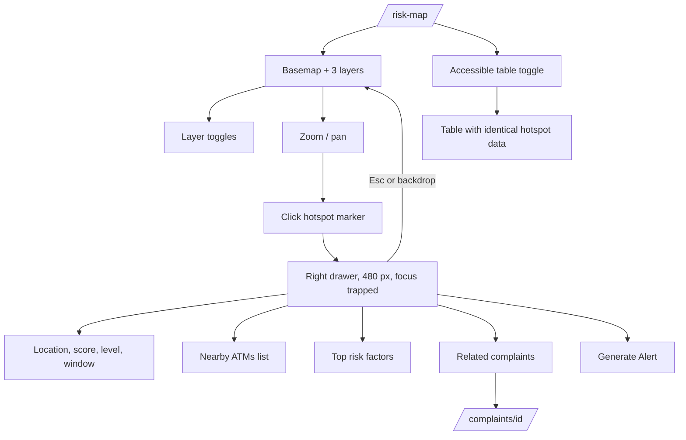

# UX USER FLOWS — CyberPulse AI

| Field | Value |
|---|---|
| Version | 1.0 |
| Scope | Screen-level flow, navigation model and information architecture |
| Related | `product/user-flows.md` (system-level), `ux/wireframes.md` (layout) |

---

## 1. Information Architecture

```
CyberPulse AI
│
├── Dashboard              /dashboard          National operating picture + demo entry
├── Complaints             /complaints         Registry (queue)
│   └── Complaint detail   /complaints/[id]    Case view + prediction
├── Risk Map               /risk-map           GIS console
├── Transactions           /transactions       Ledger
│   └── Transaction detail /transactions/[id]  Single movement + network entry
├── Investigations         /investigations     Case list
│   └── Investigation      /investigations/[id] Consolidated case surface
├── Alerts                 /alerts             Dispatched alert list
│   └── Alert detail       /alerts/[id]        Single alert + acknowledgement
├── Reports                /reports            Analytics + model evaluation
├── Settings               /settings           Mode, model, thresholds, health
└── Demo                   /demo               Guided presentation mode (not in sidebar)
```

**Depth rule.** No destination is more than two levels deep. Any task requiring three levels of navigation is a design defect.

**`/demo` is deliberately excluded from the sidebar.** It is reached by the dashboard's **RUN DEMO SCENARIO** control or by direct URL, so the production surface never looks like a demo product.

---

## 2. Global Navigation Model

### 2.1 Persistent sidebar (240 px, collapsible to 64 px)

```
┌────────────────────────────┐
│  ◈ CYBERPULSE AI           │
│    Cyber-Fraud             │
│    Intelligence Platform   │
├────────────────────────────┤
│  ▣ Dashboard               │
│  ▤ Complaints          [12]│
│  ◉ Risk Map                │
│  ⇄ Transactions            │
│  ⌕ Investigations       [4]│
│  ⚑ Alerts               [3]│
│  ▦ Reports                 │
│  ⚙ Settings                │
├────────────────────────────┤
│  Safer Citizens.           │
│  Smarter Enforcement.      │
│  Stronger India.           │
├────────────────────────────┤
│  Ministry of Home Affairs  │
│  Indian Cyber Crime        │
│  Coordination Centre (I4C) │
│  CIS Division              │
│                            │
│  ⚠ PROTOTYPE — not an      │
│    official MHA/I4C system │
└────────────────────────────┘
```

Badge counts show open items for the active role. The attribution block names the problem-statement context and is immediately followed by the prototype disclaimer, so the two are never read apart.

### 2.2 Top header (64 px, sticky)

| Zone | Content |
|---|---|
| Left | Scope selector — "National View" / state selector |
| Centre-left | Date range picker (default: last 30 days) |
| Centre-right | Role selector — LEA / BANK / ADMIN, labelled "Prototype role" |
| Right | `● Live Prototype` indicator · `SAMPLE / SYNTHETIC PROTOTYPE DATA` badge · health dot |

The synthetic-data badge is in the header rather than a footer because it must be visible in every screenshot anyone takes of any screen (FR-25, AC-015-04).

---

## 3. Dashboard Flow



Every KPI card is a navigation control, not a static figure. "High-Risk Alerts: 3" navigates to `/alerts?severity=HIGH`. A number the user cannot act on is a wasted card.

**Layout at 1920×1080:**

```
┌──────────┬──────────────────────────────────────────────────────────────┐
│          │ National View │ Last 30 days │ Role: LEA │ ● Live │ SYNTHETIC│
│ SIDEBAR  ├──────────────────────────────────────────────────────────────┤
│          │ ┌────────┐┌────────┐┌────────┐┌────────┐                     │
│          │ │Total   ││Suspect ││High-   ││Predicted│   [RUN DEMO ▸]     │
│          │ │Complnts││Txns    ││Risk    ││Hotspots │                    │
│          │ └────────┘└────────┘└────────┘└────────┘                     │
│          ├────────────────────────────────────┬─────────────────────────┤
│          │                                    │ TOP PREDICTED HOTSPOTS  │
│          │                                    │ 1 Sector 18, Noida 91.7%│
│          │        INDIA GIS MAP               │ 2 Gurugram        87.2% │
│          │        (heatmap + hotspots)        │ 3 Dwarka, Delhi   81.4% │
│          │                                    │ 4 Navi Mumbai     76.9% │
│          │                                    │ 5 Whitefield, BLR 73.1% │
│          ├────────────────────────────────────┴─────────────────────────┤
│          │ RECENT ALERTS                                                │
│          ├──────────────┬──────────────────┬──────────────────────────  │
│          │ Risk         │ Transaction      │ Actionable Alert           │
│          │ Prediction   │ Network          │                            │
└──────────┴──────────────┴──────────────────┴────────────────────────────┘
```

> Hotspot names and percentages shown above are **illustrative layout placeholders**. At runtime every value is read from the API response (AC-GLOBAL-01); no figure in this document may be hard-coded into the application.

---

## 4. Complaint → Prediction Flow (the critical path)



**Empty-state copy before analysis:** "No prediction yet. Analyse this complaint to forecast likely cash-withdrawal locations and an expected time window."

**Progressive disclosure order:** risk level → hotspot → window → factors (collapsed) → ranked alternatives (collapsed). The officer sees the decision first and the evidence on demand.

---

## 5. Alert Composition Flow



The intelligence block is **read-only by design**. Risk score, severity and estimated exposure are server-computed; allowing edits would break AC-GLOBAL-01 and would let a user alter the record of what the model actually said.

---

## 6. Map Interaction Flow



---

## 7. Navigation Rules

| Rule | Rationale |
|---|---|
| Sidebar item is always highlighted for the active route, including detail routes | Users lose orientation in two-level navigation |
| Detail routes show a breadcrumb back to their list | Browser back is not a design |
| Filters persist in the URL query string | A filtered view must be shareable and reloadable |
| Modals never navigate; drawers never navigate | Overlays are for focused actions, not for travel |
| Escape closes the topmost overlay only | Predictable dismissal |
| No auto-navigation on data change | The system must never move the user without an action |
| External links: none in the prototype | Nothing leaves the console |

---

## 8. Loading, Empty and Error States by Surface

| Surface | Loading | Empty | Error |
|---|---|---|---|
| Complaint list | 25 row skeletons | "No complaints match these filters" + Clear filters | Retryable banner above the table, previous rows retained |
| Complaint detail | Section skeletons | n/a | Not-found state with a route back to `/complaints` |
| Prediction panel | Skeleton in the panel only | "No prediction yet" + explanation of what analysis does | Degraded panel naming the unavailable capability, with retry |
| Map | Basemap first, then layer spinners | "No hotspots for this filter", map stays interactive | Bundled outline fallback with a notice |
| Graph | Node placeholders | "No linked transactions for this complaint" | Per-node error state; the rest of the graph still renders |
| Alerts | Row skeletons | "No alerts dispatched yet" | Retryable banner |
| Reports | Per-chart skeletons | Per-chart empty state | Per-chart error, other charts unaffected |
| Model metrics | Skeleton | "Model evaluation not yet run" | Same as empty — never zeros |

**Rule:** an error in one panel never blanks the page. Every surface degrades independently.

---

## 9. Keyboard Model

| Key | Action |
|---|---|
| `/` | Focus the search field on list routes |
| `g` then `d` / `c` / `m` / `a` / `i` / `r` | Go to Dashboard / Complaints / Map / Alerts / Investigations / Reports |
| `Enter` on a focused row | Open the detail route |
| `Esc` | Close the topmost overlay |
| `Tab` / `Shift+Tab` | Move focus; trapped inside modals and drawers |
| `?` | Open the keyboard shortcut sheet |

All primary actions are reachable without a pointer (NFR-09, AC referenced in `ux/accessibility.md`).
